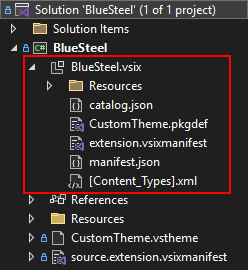

[marketplace]: <https://marketplace.visualstudio.com/items?itemName=MadsKristensen.VsixTreeViewer>
[vsixgallery]: <https://vsixgallery.com/extension/VsixTreeViewer.8bc7b2af-9ddc-4b5d-9983-6a980b3d0243/>
[repo]: <https://github.com/madskristensen/VsixTreeViewer>

# VSIX Tree Viewer for Visual Studio

Download the extension from the [Visual Studio Marketplace][marketplace], or install the latest [CI build][vsixgallery].

> Requires Visual Studio 2022 version 17.6 or later.

VSIX Tree Viewer adds the generated `.vsix` package as an expandable node beneath each VSIX project in Solution Explorer. It is designed for extension authors who need to verify exactly what will be shipped without repeatedly extracting packages by hand.

## Features

- Browses package folders and files directly in Solution Explorer.
- Supports legacy and SDK-style VSIX projects, including target-framework output folders such as `bin\Debug\net48`.
- Uses evaluated VSSDK output properties when available and safely falls back to output-folder discovery.
- Reads ZIP metadata without extracting the complete package.
- Opens individual package entries as read-only temporary copies.
- Refreshes automatically after successful builds and when an external process replaces the package.
- Shows package identity, version, publisher, installation targets, size, and asset count in the root tooltip.
- Shows visible error state for failed builds, corrupt packages, access failures, and locked output.

## Context menu commands

Right-click the generated VSIX node to:

- Open the package in File Explorer.
- Copy its path.
- Extract the complete package to a selected folder.
- Open the packaged manifest.
- Rebuild the VSIX project.
- Refresh the package contents.

Right-click package folders and files to copy their package-relative paths. File entries also support **Open Containing Folder** and **Copy File**. Copy File places the on-demand read-only copy on the Windows clipboard so it can be pasted into File Explorer or another application.

## Package discovery

The extension first checks the evaluated `TargetVsixContainer` and `TargetVsixContainerName` properties. It then checks the active output directory and target-framework subfolder. Recursive output-directory discovery is used only as a compatibility fallback.

The live build output is copied to a stable temporary snapshot before inspection. Recent snapshots are retained temporarily, and materialized files that have not been used for seven days are cleaned automatically.

## Temporary files

Opening a packaged file materializes only that entry beneath the user's temporary directory. The copy is marked read-only to avoid confusing it with project source. Choosing **Extract Package** creates normal writable files in the selected destination.

## Contributing

Found a bug or have a feature idea? Search the [GitHub repository][repo] and open an issue if one does not already exist. Pull requests are welcome.

If this extension saves you time, consider leaving a rating on the [Visual Studio Marketplace][marketplace] or [sponsoring the project](https://github.com/sponsors/madskristensen).